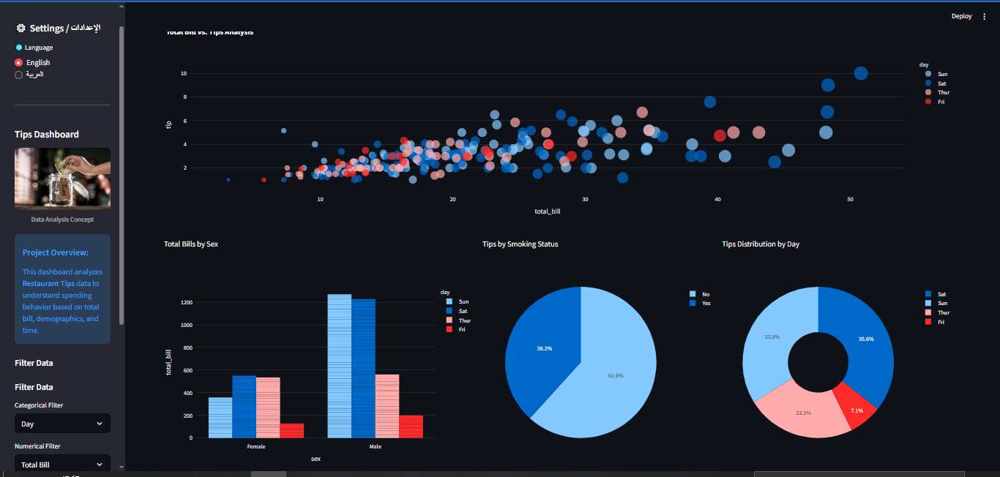

# 💰 Restaurant Tips Dashboard

[](https://tips-dashboard1.streamlit.app/)

An interactive data analysis dashboard built with **Python** and **Streamlit** to analyze restaurant tipping behavior. The application visualizes relationships between total bills, tips, and customer demographics.



## 🌟 Features
- **Multi-Language Support:** Fully supports **English** and **Arabic** (Ar/En).
- **Interactive Filtering:** Filter data by Gender, Smoker status, Day, and Time.
- **Dynamic Visualizations:**
  - Scatter Plots (Bill vs. Tip).
  - Pie & Donut Charts (Distribution by Day/Smoker).
  - Bar Charts (Demographics).
- **Responsive Design:** Works on desktop and mobile.

## 🛠️ Technologies Used
- **Python**
- **Streamlit** (Web App Framework)
- **Pandas** (Data Manipulation)
- **Plotly Express** (Interactive Charts)
- **Seaborn** (Data Visualization)

## 🚀 How to Run Locally

1. **Clone the repository:**
   ```bash
   git clone [https://github.com/Loai-Alrazi/Tips-Dashboard.git](https://github.com/Loai-Alrazi/Tips-Dashboard.git)